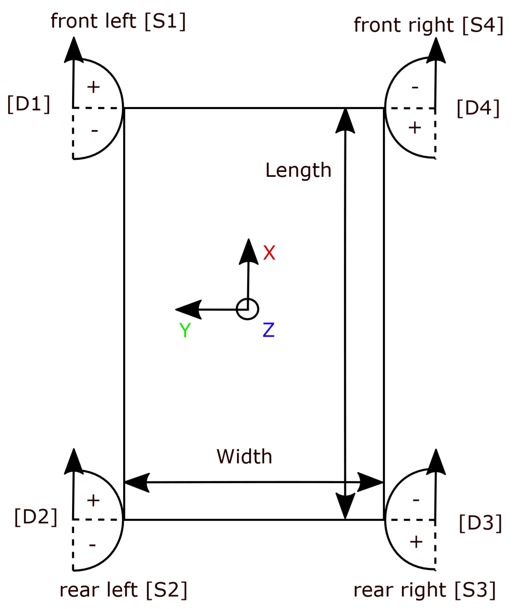
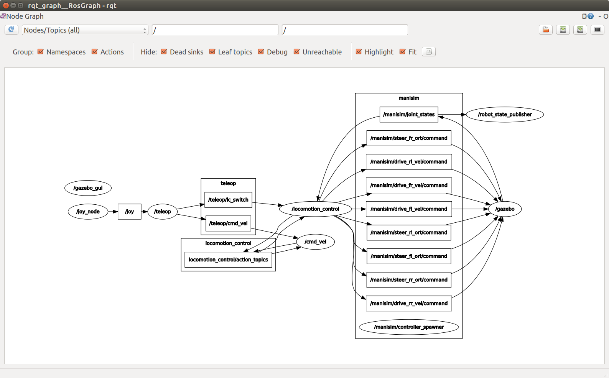
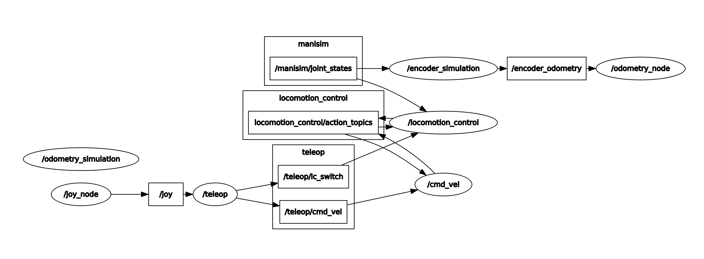
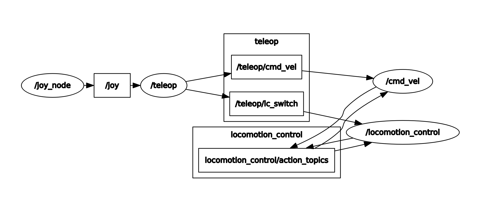

# MANIros
Base ROS package to develop with the MANI rover. Provides a high level api for the available sensors and motors.

## Rover

The Rover coordinate system and indexing is displayed in the following image:




## Development

Development is done on topic branches, if you work on a new feature create your own branch and start working. After your
done create a pull request against the `develop` branch. If all tests complete successfully, and there are additional
ones for new features, it can be reviewed and merged into `master`.

## Software Environment

All ROS nodes are written in Python. As far as possible all nodes are tested trough rostests on all node functions. The tests use Python unittests. An introduction to writing tests for ROS can be found [here](http://wiki.ros.org/unittest).
By means of continuous integration the [MANIros git](https://github.com/PTScientists/MANIros) uses Travis software to create a docker container setting up a mock image of the \ac{obc} to run all test files on each git push. The test results are then displayed on the git.

## ROS

[Wikipedia's Definition](https://en.wikipedia.org/wiki/Robot_Operating_System) _July 24th 2019, 15:57 CET_

> Robot Operating System (ROS or ros) is robotics middleware (i.e. collection of software frameworks for robot software development). Although ROS is not an operating system, it provides services designed for a heterogeneous computer cluster such as hardware abstraction, low-level device control, implementation of commonly used functionality, message-passing between processes, and package management.

To get started with ROS, you can find a useful tutorial [here](http://wiki.ros.org/ROS/Tutorials).

### ROS Nodes

The ROS nodes for the teleoperation branch is visualised below in rqt_graph for the Gazeebo simmulation example:



### ROS Parameters

The main hardware specific parameters such as rover dimensions, sensor positions, encoder pulses per revolution can be set in the /config/mani.yaml file. They are imported to the ros nodes from this location.

So far the following nodes have been implemented and/or installed:

* LC
 - joy node - transforms joystick input to a ROS Joy message
 - teleop node - passes on selected joystick input to ROS LC messages
 - cmd_vel node - muxer for autonomous and teleoperation commands and client for rover movement actions
 - locomotion_control action - action server for sending locomotion control via CAN bus
 - locomotion_control_simulation action - action server for sending locomotion control via simulation
 - odometry publisher - transforms encoder feedback to rover odometry
 - encoder simulation - simjulates encoder feedback by transforming joints states from simulation
* Sensors
 - IMU publisher - publishes IMU data
 - IMU transform - coordinate system transformation from IMU to rover base
 - PicoFlexx camera publisher - publishes \ac{tof} camera footage
 - ZED Cam camera publisher - publishes stereo camera footage


For an explanation and tutorials on ROS transformations please visit [ROS tf2 package](http://wiki.ros.org/tf2).

The following two images present the node and topic relations for the teleoperation control of the rover using a game pad. They show the setup that connects to the simulation and the setup communicating via the CAN bus, respectively. Square boxes represent topics that nodes are connected to, while oval shapes denote nodes.






### Installation

#### Flashing Linux Kernel

The operating system that is running on the Tegra board is a customized version of Ubuntu 16.04 LTS (Xenial), called Linux for Tegra (L4T). The latest supported L4T version on our TX2 board is 28.2.1.
To flash the OS on the Jetson complete the following steps:

* Download the OS and the File System [here](https://developer.nvidia.com/embedded/linux-tegra-r2821).
* If possible, follow [these steps](http://developer2.download.nvidia.com/embedded/L4T/r28_Release_v2.0/BSP/l4t_quick_start_guide.txt) on a regular Ubuntu 16.04 Host.
* After the device was flashed successfully, please update all packages:
		```
        $ sudo apt update
        $ sudo apt upgrade
		```

#### Installing Software and Dependencies

To get all the required dependencies on your Jetson board this [Ansible
scripts](https://github.com/PTScientists/MANIansible) can be used, after that place [MANIros package](https://github.com/PTScientists/MANIros) at $$\sim$$/catkin_ws/src/maniros. If you prefer the latest development version use the _develop_ branch, otherwise pick the desired branch.

Any further ROS packages that might be desired can be installed through:

```
$ sudo apt install ros-kinetic-<package-name>
```


#### Camera

Installing the __ZED Cam ROS node__:


 * Download [Download Cuda Toolkit 10.0](https://developer.nvidia.com/cuda-10.0-download-archive?target_os=Linux&target_arch=x86_64&target_distro=Ubuntu&target_version=1604&target_type=deblocal).
     (higher versions are currently not supported)
* Install Cuda Toolkit 10.0.
        Terminal Installation for .deb file:
        ```
        $ cd ~/Downloads
        $ sudo dpkg -i cuda-repo-ubuntu1604-10-0-local-10.0.130-410.48_1.0-1_amd64.deb
        $ sudo apt-key add /var/cuda-repo-10-0-local-10.0.130-410.48/7fa2af80.pub
        $ sudo apt-get update
        $ sudo apt-get install cuda-10.0
        ```

* After the Cuda installtion download \chref{https://www.stereolabs.com/developers/release/#sdkdownloads_anchor}{SDK}.

* Install SDK.
        Installation via the .run file:
        ```
        $ cd ~/Downloads
        $ chmod +x ZED_SDK_Ubuntu16_v2.8.2.run
        $ sudo apt-key add /var/cuda-repo-10-0-local-10.0.130-410.48/7fa2af80.pub
        $ ./ZED_SDK_Ubuntu16_v2.8.2.run
        ```

* Install the [ZED ROS wrapper](https://github.com/stereolabs/zed-ros-wrapper.git).
		```
        $ cd ~/catkin_ws/src
        $ git clone https://github.com/stereolabs/zed-ros-wrapper.git
        $ cd ../
        $ catkin_make
        $ source ./devel/setup.bash
        ```

* Test the installation through zed.launch file.
		```
        $ roslaunch zed_wrapped zed.launch
        ```


If there is any questions concerning the installation or on getting stated with the ZED Cam consult the [ZED ROS wrapper git](https://www.stereolabs.com/docs/ros/) or the [Stereolabs ROS documentation](https://www.stereolabs.com/docs/ros/).


The __PicoFlexx ROS node__ is setup as follows:


* Download the [royale driver software](https://pmdtec.com/picofamily/software-download/).
        The password for the download is: Sh!2CBpf.
* Follow the instructions on the [PicoFlexx ROS driver git](https://github.com/code-iai/pico_flexx_driver).
        _In point 9 of the install, start rviz with "rosrun rviz rviz -f pico_flex_link", otherwise you'll get an error._
* Then configure rviz:

 - Fixed Frame: royale_camera_link
 - Add new → PointCloud2
 - Select royale topic


## CAN Bus
The CAN interface is set to **can0** but may be set to **can1** if desired.
The adequate pins on the J26 Expansion Header of the Jetson are:

| Interface | CAN_STBY | CAN_RX | CAN_TX|
|:----------|:----------:|:--------:|:-------:|
| can0 | Pin 4 | Pin 5| Pin 7 |
| can1 | Pin 14 | Pin 15 | Pin 17 |

On the BluePill (STM32F103C8T6) micro-controllers there is only one can interface **can1**, the pins are:

| Interface | CAN_STBY | CAN_RX | CAN_TX|
|:----------|:----------:|:--------:|:-------:|
| can1 | - | PB_8 | PB_9 |
| can1 | - | PA_11 | PA_12 |

The CAN_STBY pin is not defined and can be set to any logical output pin.
**The (PA_11, PA_12) pins are also connected to the USB therefore they may be blocked by USB applications.**

### Getting Started


The pin numbering of the STM32F103C8T6 will be noted in the image above.
In order to get started with CAN on the BluePill boards, the example (https://os.mbed.com/users/hudakz/code/CAN_Hello/) gives all necessary background and sample code to set up a breadboard bus.

### Parameters

The CAN bus bit rate is adjusted by setting **FREQUENCY**.
The maximum wheel velocity **MAX_VEL**, as well as the encoder pulses per revolution **DRIVE_ENC_PPR** and **STEER_ENC_PPR**, can be set in the mani.yaml ROS parameter configuration file on the OBC or in the defines.h file on the Drive Nodes.
If the parameters are changed, they must be adjusted on all nodes connected to the bus.

### Protocol

The standard CAN message format was used for the CAN protocol used on the rover. The message ID consists of an 11 bit value and the data length is variable 0-8 bytes.
All messages are passed to or from the OBC. No messages are transferred between the CAN motor or EPS nodes.
To make the protocol simple the ID's are hexadecimal numbers with the last digit referring to the node, that the message is determined for or originating from.
The second last digit refers to message type, automatically transcribing a priority order to the message types.

The message data is sent in two different formats; booleans and integers.
Booleans represent state switches and feedback information, whilst integers are used for passing specific feedback or command information between the nodes and the OBC.
For simplicity integer values are passed as follows:
* orientation [pulses]
* velocity [pulses per second]
* revolutions [revolution counter]
One boolean is sent in a byte of data. The integers are sent as short signed integers that take up 2 bytes of data, which leaves enough space for the revolutions to build up to tens of kilometers of drive distance.


#### Message ID's:

Messages with lower numeric ID values have higher priority on the CAN network. All message ID's are given in Hexadecimal.
To ensure the priority of specified commands, each command has its own range denoted by the letter in the hex numbers.
Each command further has its own identifier number to indicate which node it is specified for or originating from. The OBC is the only communication point to the other nodes and does therefore not need an identifier number.

| Position/function on rover | Identifier number | ID's |
|:---------------------------|:------------------:|:----:|
| electrical power supply | 0 | 0xXX0 |
| front_left wheel | 1 | 0xXX1 |
| rear_left wheel | 2 | 0xXX2 |
| rear_right wheel | 3 | 0xXX3 |
| front_right wheel | 4 | 0xXX4 |

#### Message List

| Message | ID's | Description | Sender | Receiver | Data length | Data division |
|:--------|:----:|:-----------:|:------:|:--------:|:-----------:|:-------------:|
| powerCmd | 0x000 | Power switch command for all motors | OBC| EPS Node | 1 byte | motorPower \[0,1\] *(byte 1)* |
| errorWrn | 0x010 | Overcurrent warning for EPS current sensors | EPS Node| OBC | 5 bytes | errorSensor1 \[0,1\] *(byte 1)*; errorSensorB \[0,1\] *(byte 1)*; errorSensorFL \[0,1\] *(byte 2)*; errorSensorRL \[0,1\] *(byte 3)*; errorSensorRR \[0,1\] *(byte 4)*; errorSensorFR \[0,1\] *(byte 5)* |
| currentWrn | 0x020 | Critical current warning for EPS current sensors *(over 80 percent of max current)*; | EPS Node| OBC | 5 bytes | critSensor1 \[0,1\] *(byte 1)*; critSensorB \[0,1\] *(byte 1)*; critSensorFL \[0,1\] *(byte 2)*; critSensorRL \[0,1\] *(byte 3)*; critSensorRR \[0,1\] *(byte 4)*; errorSensorFR \[0,1\] *(byte 5)* |
| powerFb | 0x030 | Motor power switch status feedback | EPS Node | OBC | 1 byte | motorPower \[0,1\] *(byte 1)* |
| currentFb | 0x0E0 | EPS current meassurement feedback/update | EPS Node| OBC | 8 bytes | sensorIdx \[0,3\] *(bytes 1 to 4)*; current \[0..2147483647\] *(bytes 5 to 8)* |
| switchCmd | 0x0AX | Switch command for steering/driving motor power and initialisation for odometry publisher and zeroing steering encoders | OBC| Drive Node | 4 bytes | steerMode \[0,1\] *(byte 1)*; driveMode \[0,1\] *(byte 2)*; publisherMode \[0,1\] *(byte 3)*; zeroEncoders \[0,1\] *(byte 4)* |
| orientationCmd | 0x0BX | Set orientation command | OBC| Drive Node | 4 bytes | set_orientation \[-32768..32768\] *(bytes 1 to 2)* |
| velocityCmd | 0x0CX | Set velocity command | OBC| Drive Node | 4 bytes | set_velocity \[-32768..32768\] *(bytes 1 to 2)* |
| locomotionFb | 0x0DX | Locomotion task feedback for reached orientation and velocity | Drive Node | OBC | 1 byte | task_completed_flag [0,1] *(byte 1)* |
| odometryFb | 0x0EX | Odometry feedback of encoder counts and revolutions for rover distance traveled as well as steering position and drive velocity in encoder pulses | Drive Node | OBC | 8 bytes | orientation \[-32768..32768\] *(bytes 1 to 2)*; velocity \[-32768..32768\] *(bytes 3 to 4)*; pulses \[-32768..32768\] *(bytes 5 to 6)*; revolutions \[-32768..32768\] *(bytes 7 to 8)* |

**The orientation and velocity are handled in pulses or pulses per second, respectively. They depend on the number of pulses per revolution for the encoders used (STEER_ENC_PPR, DRIVE_ENC_PPR).**
