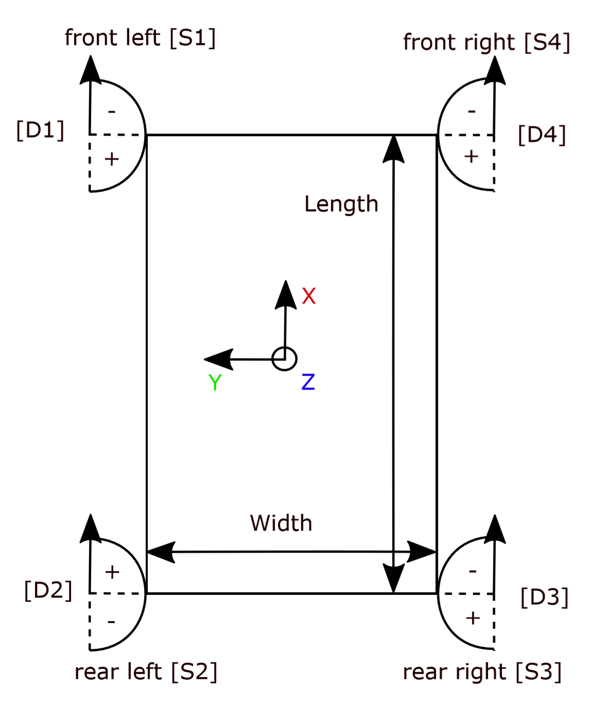

# MANIros
Base ROS package to develop with the MANI rover. Provides a high level api for the available sensors and motors.

## Rover

The Rover coordinate system and indexing is displayed in the following image:

## Installation

To get all the required dependencies on your jetson board [these](https://github.com/PTScientists/MANIansible) ansible
scripts can be used, after that place this package at `~/catkin_ws/src/maniros`. If you prefere the latest development
version use the `develop` branch, otherwise pick `master`.

## Development

Development is done on topic branches, if you work on a new feature create your own branch and start working. After your
done create a pull request against the `develop` branch. If all tests complete successfully, and there are additional
ones for new features, it can be reviewed and merged into master. 

## CAN Bus
The CAN interface is set to **can0** but may be set to **can1** if desired.
The adequate pins are:

| Interface | CAN_STBY | CAN_RX | CAN_TX|
|:----------|:----------:|:--------:|:-------:|
| can0 | Pin 4 | Pin 5| Pin 7 |
| can0 | Pin 14 | Pin 15 | Pin 17 |

### Parameters

The CAN bus bit rate is adjsuted by setting **FREQUENCY**.
The maximum wheel velocity **MAX_VEL** can be set at the top of the Pyhton code on the OBC or in the defines.h file on the Drive Nodes.
If the parameters are changed, they must be adjusted on all nodes connected to the bus.

#### Message ID's:

Messages with lower numeric values for their ID's have higher priority on the CAN network. All message ID's are given in Hexadecimal.
To ensure the priority of specified commands, each command has its own range denoted by the letter in the hex numbers.
Each command further has its own indentifier number to indicate which node it is specified for or originating from. The OBC is the only communication point to the other nodes and does therefore not need an indentifier number.

##### ID List

| Position/function on rover | Indentifier number | ID's |
|:---------------------------|:------------------:|:----:|
| electrical power supply | 0 | 0xXX0 |
| front_left wheel | 1 | 0xXX1 |
| rear_left wheel | 2 | 0xXX2 |
| rear_right wheel | 3 | 0xXX3 |
| front_right wheel | 4 | 0xXX4 |

##### Command List

| Message | ID's | Description | Sender | Receiver | Data length | Data division |
|:--------|:----:|:-----------:|:------:|:--------:|:-----------:|:-------------:|
| powerCmd | 0x000 | Power switch command for all motors | OBC| EPS Node | 1 byte | motorPower \[0,1\] (byte 1) |
| errorWrn | 0x010 | Overcurrent warning for EPS current sensors | EPS Node| OBC | 5 bytes | errorSensor1 \[0,1\] (byte 1) errorSensorB \[0,1\] (byte 1) errorSensorFL \[0,1\] (byte 2) errorSensorRL \[0,1\] (byte 3) errorSensorRR \[0,1\] (byte 4) errorSensorFR \[0,1\] (byte 5) |
| currentWrn | 0x020 | Critical current warning for EPS current sensors (over 80 percent of max current) | EPS Node| OBC | 5 bytes | critSensor1 \[0,1\] (byte 1) critSensorB \[0,1\] (byte 1) critSensorFL \[0,1\] (byte 2) critSensorRL \[0,1\] (byte 3) critSensorRR \[0,1\] (byte 4) errorSensorFR \[0,1\] (byte 5) |
| powerFb | 0x030 | Motor power switch status feedback | EPS Node | OBC | 1 byte | motorPower \[0,1\] (byte 1) |
| currentFb | 0x0E0 | EPS current meassurement feedback/update | EPS Node| OBC | 8 bytes | sensorIdx \[0,3\] (bytes 1 to 4) current \[0..2147483647\] (bytes 5 to 8) |
| switchCmd | 0x0AX | Switch command for steering/driving motor power and initialisation for odometry publisher and zeroing steering encoders | OBC| Drive Node | 4 bytes | steerMode \[0,1\] (byte 1) driveMode \[0,1\] (byte 2) publisherMode \[0,1\] (byte 3) zeroEncoders \[0,1\] (byte 4) |
| orientationCmd | 0x0BX | Set orientation command | OBC| Drive Node | 4 bytes | set_orientation \[-2147483647..2147483647\] (bytes 1 to 4) |
| velocityCmd | 0x0CX | Set velocity command | OBC| Drive Node | 4 bytes | set_velocity \[-2147483647..2147483647\] (bytes 1 to 4) |
| locomotionFb | 0x0DX | Locomotion task feedback for reached orientation and velocity | Drive Node | OBC | 1 bytes | task_completed (byte 1) [0,1]|
| odometryFb | 0x0EX | Odometry feedback of absolute encoder counts for rover distance traveled | Drive Node | OBC | 8 bytes | pulses \[-2147483647..2147483647\] (bytes 1 to 4) revolutions \[-2147483647..2147483647\] (bytes 5 to 8) |

**The velocity and orientation are scaled values based on the maximal velocity and orientation, respectively.**
